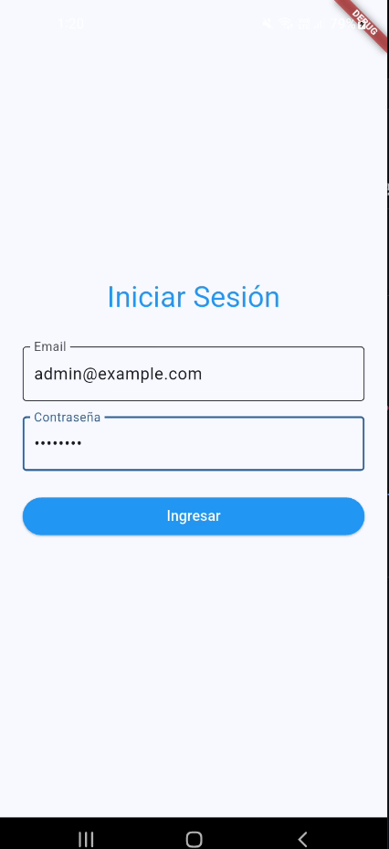
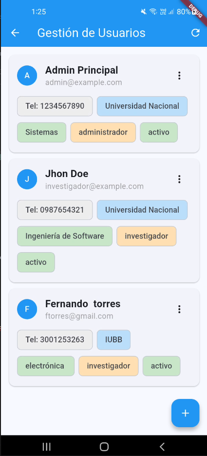
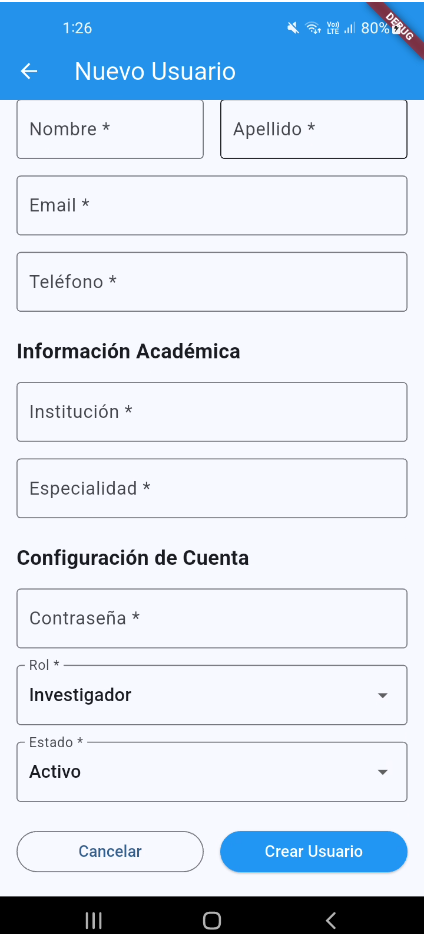
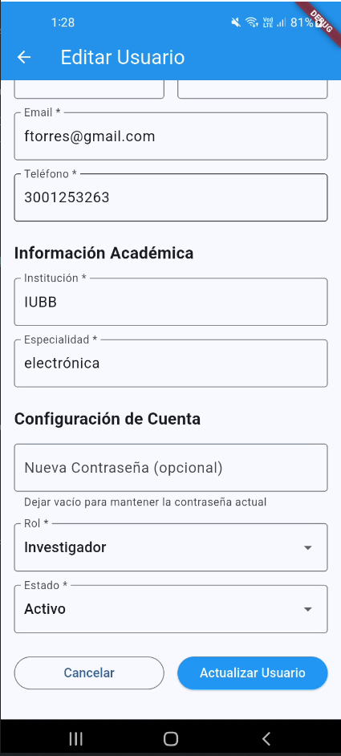

# ☕ GIIT APP

Una aplicación móvil del **Sistema de Gestión de Investigación e Innovación Tecnológica (GIIT)** desarrollada con Flutter.

## 📱 Características

- **Gestión de Usuarios**: Crear, editar y administrar usuarios del sistema GIIT
- **Autenticación**: Sistema de login seguro con validación de credenciales
- **Roles de Usuario**: Soporte para Administradores e Investigadores
- **Interfaz Intuitiva**: Diseño moderno y fácil de usar con Material Design
- **Multiplataforma**: Funciona en Android, iOS, Web y Desktop
- **Estado Reactivo**: Actualización automática de la interfaz con Riverpod
- **Navegación Declarativa**: URLs amigables y navegación tipada con GoRouter

## 📸 Capturas de Pantalla

### Pantalla de Login


### Gestión de Usuarios


### Crear Usuario


### Editar Usuario


## 🚀 Instalación

### Prerrequisitos
- [Flutter](https://flutter.dev/) (versión 3.8.1 o superior)
- [Dart](https://dart.dev/) 
- Android Studio / VS Code
- Emulador Android o dispositivo físico

### Pasos de instalación

1. **Clona el repositorio**
   ```bash
   git clone <tu-repositorio-url>
   cd giitapp
   ```

2. **Instala las dependencias**
   ```bash
   flutter pub get
   ```

3. **Ejecuta la aplicación**
   ```bash
   flutter run
   ```

## 🏗️ Estructura del Proyecto

```
lib/
├── main.dart           # Punto de entrada de la aplicación
├── models/            # Modelos de datos
│   └── user.dart      # Modelo de usuario con roles
└── screens/           # Pantallas de la aplicación
    ├── login_screen.dart
    ├── user_management_screen.dart
    ├── create_user_screen.dart
    └── edit_user_screen.dart
```

## 📦 Dependencias Principales

### 🔄 **Riverpod** (`flutter_riverpod: ^2.4.0`)

**¿Qué es?** Una librería de gestión de estado reactiva y robusta para Flutter.

**¿Cómo ayuda al desarrollo?**
- **Gestión Centralizada de Estado**: Todos los datos de usuarios, formularios y estados de carga se manejan de forma centralizada
- **Reactividad Automática**: La UI se actualiza automáticamente cuando cambian los datos
- **Inmutabilidad**: Previene bugs al usar estados inmutables
- **Performance Optimizada**: Solo reconstruye widgets que realmente necesitan actualizarse
- **Testabilidad**: Fácil de probar unitariamente cada provider

**Implementación en GIIT:**
```dart
// Gestión de estado de usuarios
final usersNotifierProvider = StateNotifierProvider<UsersNotifier, UsersState>((ref) {
  return UsersNotifier();
});

// Gestión de formularios
final loginFormProvider = StateProvider.autoDispose<LoginFormState>((ref) => LoginFormState());
```

### 🗺️ **GoRouter** (`go_router: ^13.2.0`)

**¿Qué es?** La librería oficial de navegación declarativa de Flutter.

**¿Cómo ayuda al desarrollo?**
- **URLs Declarativas**: Cada pantalla tiene una ruta clara (`/login`, `/admin`, `/create-user`)
- **Navegación Tipada**: Reduce errores al pasar datos entre pantallas
- **Deep Linking**: Soporte nativo para enlaces profundos
- **Web Support**: URLs reales y navegación con botones del navegador
- **Gestión Automática**: Maneja automáticamente el historial y el botón "atrás"

**Implementación en GIIT:**
```dart
final _router = GoRouter(
  initialLocation: '/login',
  routes: [
    GoRoute(path: '/login', builder: (context, state) => const LoginScreen()),
    GoRoute(path: '/admin', builder: (context, state) => const UserManagementScreen()),
    GoRoute(path: '/create-user', builder: (context, state) => const CreateUserScreen()),
    GoRoute(path: '/edit-user', builder: (context, state) {
      final user = state.extra as User;
      return EditUserScreen(user: user);
    }),
  ],
);
```

### 🌐 **HTTP** (`http: ^1.1.0`)

**¿Qué es?** Cliente HTTP para realizar peticiones a APIs REST.

**¿Cómo ayuda al desarrollo?**
- **Conexión con Backend**: Comunicación con la API REST de GIIT
- **Operaciones CRUD**: Crear, leer, actualizar y eliminar usuarios
- **Autenticación**: Envío seguro de credenciales de login
- **Manejo de Errores**: Gestión de respuestas del servidor

## 🛠️ Tecnologías Utilizadas

- **Flutter** - Framework de desarrollo multiplataforma
- **Dart** - Lenguaje de programación moderno y eficiente
- **Material Design 3** - Sistema de diseño de Google
- **Riverpod** - Gestión de estado reactiva
- **GoRouter** - Navegación declarativa
- **HTTP** - Cliente para APIs REST

## 🔧 Arquitectura de la Aplicación

### **Patrón de Arquitectura**
- **MVVM con Riverpod**: Model-View-ViewModel usando providers
- **Separación de Responsabilidades**: UI, lógica de negocio y datos separados
- **Estado Inmutable**: Todos los estados son inmutables para mayor estabilidad

### **Flujo de Datos**
```
Usuario Interactúa → Widget → Provider (Riverpod) → HTTP Request → API → Response → Provider → Widget → UI Actualizada
```

### **Gestión de Estados**
- **LoginFormProvider**: Estado del formulario de login
- **UsersNotifierProvider**: Lista de usuarios y operaciones CRUD
- **CreateUserFormProvider**: Estado del formulario de creación
- **EditUserFormProvider**: Estado del formulario de edición

## 📋 Funcionalidades Principales

- ✅ **Autenticación segura** con validación de credenciales
- ✅ **CRUD completo de usuarios** (Crear, Leer, Actualizar, Eliminar)
- ✅ **Navegación fluida** entre pantallas con URLs amigables
- ✅ **Validación de formularios** en tiempo real
- ✅ **Interfaz responsive** que se adapta a diferentes tamaños
- ✅ **Estados de carga** con indicadores visuales
- ✅ **Manejo de errores** con mensajes informativos
- ✅ **Gestión de roles** (Administrador e Investigador)

## 🚦 Estados de la Aplicación

### **Estados de Usuario**
- **Activo**: Usuario habilitado para usar el sistema
- **Inactivo**: Usuario temporalmente deshabilitado
- **Pendiente**: Usuario en proceso de aprobación

### **Roles del Sistema**
- **Administrador (ID: 1)**: Acceso completo al sistema
- **Investigador (ID: 2)**: Acceso limitado según permisos

